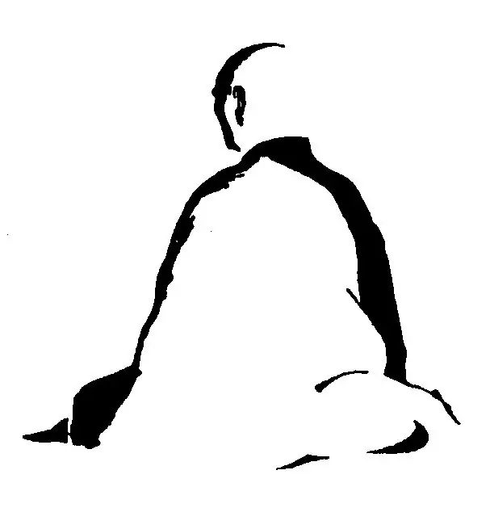
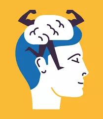

对于初学冥想的同学，冥想似乎是特别地难。当人们说冥想难，多半人们说的是让大脑安静或者是不让脑子想东西特别难，就像我当初尝试冥想的时候也是这样。对于冥想的最大误区可能就是：冥想就是安静地坐着，“什么都不要想“，但是”想“是一个我们生理本能发起的东西，你不可能关闭”想“，如果你要做  ”什么都不想“这件事情的话，本身就要用大脑来发起做这个事情的动机，而用”大脑“来抑制”大脑“， 最后不管是什么结果都是大脑胜出，不是”不去想“的想胜，就是想什么的那个什么”想“胜。  

好好，我承认有点绕；冥想，不是什么都不想！就这样啦，那你告诉我：冥想时，我要想点什么？

可能想要搞懂一点冥想，我必须要绕，所以我只能用一个更绕的回答来答复上面这个问题：

冥想是什么都不想 - 这个什么都不想是你肯定会“想”，但是当你的“想”出现时，你什么都不要去想这个出现的“想” ....

"想“的能力是我们生活中的一个关键的元素，我们需要计划，做决定，沟通，在人前的各种心机靠的都是想... 想本身没有问题，实际上你应该想的很有质量你的生活才会有质量；可是问题是我们一思考，上帝就发笑 - 因为在我们的整个一生中，我们基本上不会有什么真正新的想法； 换句话说，我们的思想都是固化的。

举一个例子，我认识一个人，她就是认为没有人喜欢她；有了这样的想法之后，就没有人可以说服她了。 你可以给她任何相反的道理甚至证据，她会说你又不是真的了解我，就算你了解我你也不会喜欢我，你只是假装喜欢我罢了，真假，整个世界都虚伪都想利用我，不利用我也是看我笑话......  

实际我们每个人或多或少都像这个怨妇，就像你看奇葩说，你先选定你的观点， 之后奇葩们怎么都能够辩出精彩，初看再荒谬的观点都可以被思想包装的头头是道。我们在生活中说到这个现象时候的比喻是“屁股决定脑袋”，不是观点改变立场，而是立场组织了你脑中的观点。我原来在咨询公司的乙方工作，我很多同事也整天唱着“甲方虐我千百遍，我对甲方如初恋”.....潜台词是这帮傻B, 这么点预算还啥都想要还只给3周时间神经病吧.....  但是同一位亲某天跳槽去了甲方，甲方那把椅子还没坐热就立刻从屁股到大脑都成了几周前自己曾经鄙视的傻B...  不是说我前同事的人品，因为换我我也是这样，这就是人的本性，大脑的本质 - 我们都以为自己可以独立思考，都是自己能够做主的人；但是，不幸的是，我们的思考全部都是被预设了，类比为生物计算机完全被编程了也差不了多少。

人的大脑只能赞同或者反对，如果一个观点和预设的赞同的立场不一样，大脑会马上出现怼回去的倾向，组织自己所有内容编织一个反方的抗辩。 我有一个修禅的朋友讲这个就像是一种病： 一种用预设脑来抵抗脑的疾病...我们都特么有病。

这样说来，冥想不是用来抑制想，而是要开发一种技巧让大脑能够同时包容正反两方相对立的观点 - 让“怼回去”的冲动平静下来。比如，从你安静坐下来开始冥想，你应该是非常安静地坐着不动，但是如果你脑中有要调整一下身体以便坐的更舒服，或者手臂痒要挠一下的想法，你该怎么办？ 假如安静地坐着意味着抵制动身体的想法，你就会发现冥想实在太难了 - 因为你抵制这个要动身体的想法的想法（“不能动，动冥想就失败了”）本身就会带来你身体肌肉的紧张，这个和我们没有冥想的时候每天大部分时间大脑的模式基本是一样的，根本就带不来身体的安静和头脑的冥想状态。

所以，冥想既不能站台正方，也不能站台反方....这个是冥想真正的难点：就是不在意，你自己脑中有一个想法出现的时候，就好像是其他人说要这样这样，但是你对她无论说的什么一点都没有兴趣。

怎样让你对你自己想什么脱离兴趣？

来自佛教和禅宗打坐的传统是强调对体姿和呼吸赋予更多的觉知和意识； 说是分散精力也对，但是你可以把分散精力从字面上理解就更接近这件事的核心了： 精力，就是能量，你脑中出现想法，这个想法需要你身体提供能量；这个和物质运动比如屈伸手臂收紧二头肌没有什么区别；实际上大强度脑力劳动的人需要吃更多食物，不比干体力活的吃的少多少就说明动脑子也需要食物给身体提供很多能量。

分散 - 就是不给脑中这个“动”赋予能量，而把能量输送线路分配给其他身体运动比如呼吸。所以，禅宗打坐保持脊柱直立的状态，可以观呼吸，感受呼吸温度，甚至数呼吸（实际上数也是一种想），都是转移能量，把赋予想这个“动”的能量带走，让这个“想”失去力量。比如阿汤圈的很多人知道John Scott老师的梵文计数，无论是阿汤口令还是冥想时梵文循环数到12都只是一个工具，不神秘，只是这个工具把能量吸走，让脑子中的随机出现的想法失去力量。 

还有一种策略是让思想“动”起来，就像拿一个球逗狗一样，因为思想就像憨憨的金毛犬，无论你向什么方向扔一个球，思想就可爱地追过去叼这个球。那么如果你扔的球方向足够刁钻混乱金毛明明看到球扔出去追过去没有球，这狗就会蒙圈。禅宗的公案用就是这招，比如忽然师傅忽然问你：“你只用一直手给我击个掌啊”， “人没有面孔长成时的面孔是什么面孔？” ；不过这招要在一个相应的能量充足的环境中才好使，可能还需要被问的人有比较好的慧根，这样有可能在脑子飞奔过去但是没有叼到球闪了一下顿悟了；但是我等慧根有限的可能以为来了个脑筋急转弯题目，脑子更加兴奋地金毛似得反而思维更活跃，绕来绕去乐此不疲..... 这个就是不是冥想，而变成金毛狂想曲了。

文章最后还想跟大家分享一个生活中的“冥想”智慧：就是一个想法或者外部的刺激来了，不要马上反应，而是给时间让这个想法沉淀一下，冷静一下，越是激动的冒泡的想法越是需要放置较长的时间， 而往往过了一段时间你发现这件事情根本就不需要用你最初即刻冲动的时候想要反应的方式反应，甚至根本不需要反应。具体的栗子如果你跟了我这个公众号超过一年，你就知道以前编辑路路同学看到不爽的留言立刻要怼回去，现在基本上很少了 （冥想练习总要有点成果吧），不是负面留言少了，而是我可以做到不在看到的瞬间当即回复，而冷静一下不仅怼回去的意愿不在了就看到过这样的留言的事情都浮云了。

实际说了这么多，有的时候民间的一句话就清楚了： 退一步海阔天空

海阔天空不就是冥想状态嘛， 退一步不就是不给瓦特爱玩儿你的想法充电赋予能量嘛。

希望我们都可以找到自己的海阔天空，而不是做追球玩的金毛犬.....

PS,  还有很多人问一冥想就犯困要睡觉怎么破？  你缺觉呀，怎么破？晚上早点上床睡觉呗。

关于冥想的小短片《冥想101 - 初学者冥想指南》也挺好玩的，上次冥想文章发过，看过就再看一遍吧。

